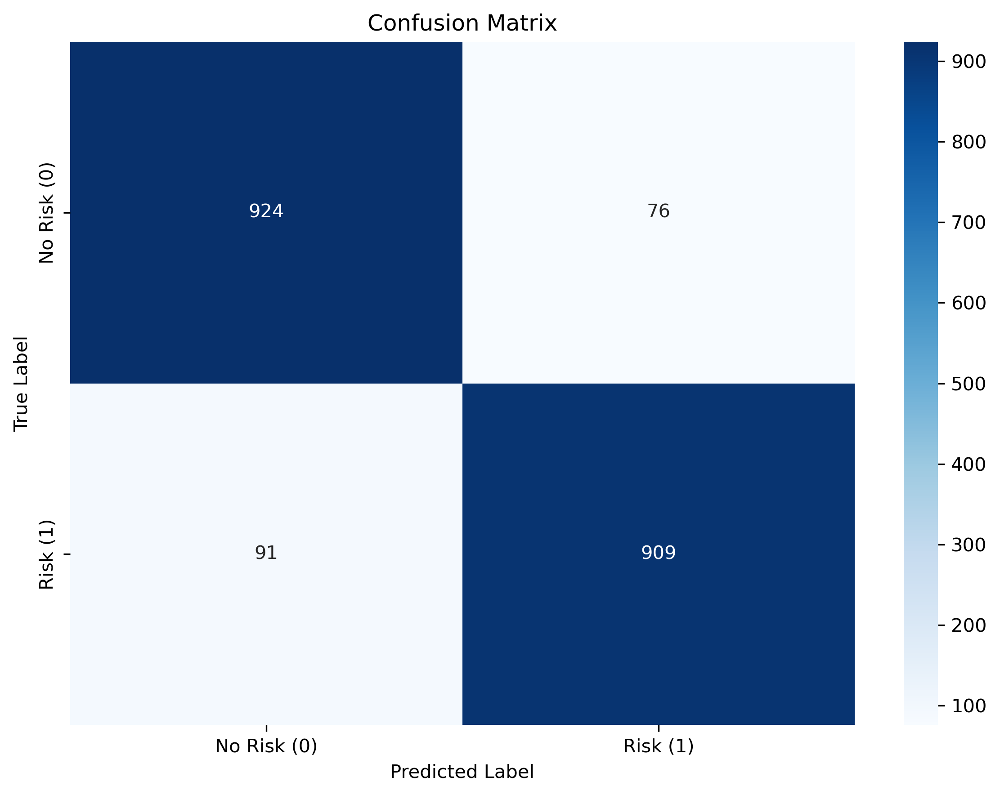
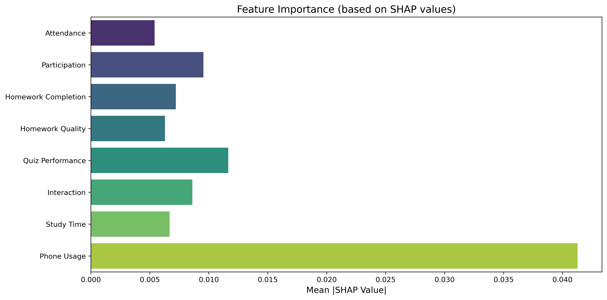
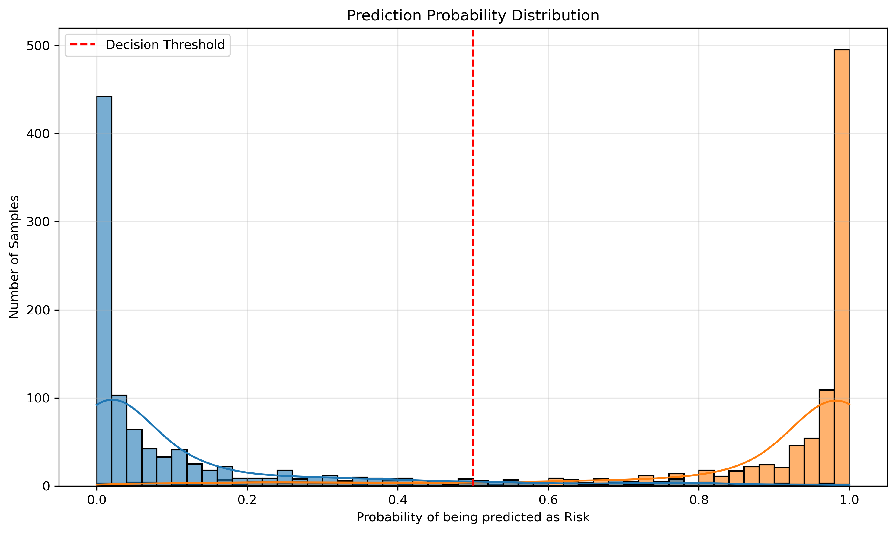
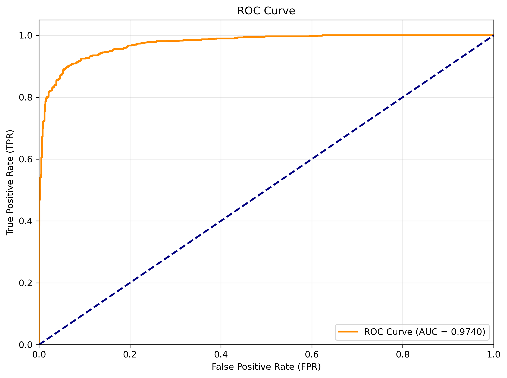

# Academic Risk Prediction with LSTM

This project demonstrates a complete machine learning pipeline for predicting student academic risk based on synthetic time-series behavioral data. It uses an LSTM (Long Short-Term Memory) neural network to classify students as "at-risk" or "not at-risk".

The entire pipeline, from data generation to model evaluation and interpretation, is included.

## Project Overview

The core idea is to simulate student behavior over an 8-week semester across 8 different metrics (e.g., attendance, homework quality, phone usage). An LSTM model is then trained to identify patterns indicative of academic risk.

- **Data Generation**: Synthetic data is created for two classes of students. "Not-at-risk" students exhibit stable, positive behavior, while "at-risk" students show declining trends.
- **Data Augmentation**: Noise and realistic perturbations (e.g., outliers, missing values, biases) are added to the clean data to simulate real-world scenarios.
- **Modeling**: A PyTorch-based LSTM classifier is used to learn from the sequential data.
- **Training & Evaluation**: The model is trained with early stopping and evaluated on a test set, achieving over 91% accuracy.
- **Explainability**: SHAP (SHapley Additive exPlanations) is used to interpret the model's predictions and identify the most influential behavioral features.

## File Structure

```
├── ckpt/
│   └── best_model.pth      # Trained model weights
├── data/                   # Generated student data
│   ├── 0/                  # Not-at-risk students (label 0)
│   └── 1/                  # At-risk students (label 1)
├── result/
│   ├── figures/            # All generated plots (confusion matrix, ROC, SHAP)
│   ├── evaluation_report.md# Summary of evaluation results
│   └── ...
├── utils/
│   ├── dataset.py          # PyTorch Dataset class
│   └── model.py            # LSTM model definition
├── data_generate.py        # Script to generate the initial clean dataset
├── add_noise.py            # Script to add noise and perturbations to the data
├── train.py                # Script to train the LSTM model
├── test.py                 # Script to evaluate the model and generate results
└── README.md               # This file
```

## How to Run

### Requirements

You need Python and PyTorch installed. You will also need other libraries like `pandas`, `numpy`, `scikit-learn`, `matplotlib`, `seaborn`, `tqdm`, and `shap`. You can install them via pip:

```bash
pip install torch pandas numpy scikit-learn matplotlib seaborn tqdm shap
```

### Step-by-Step Execution

1.  **Generate Raw Data**:
    This script creates the initial, clean dataset in the `data/` directory.

    ```bash
    python data_generate.py
    ```

2.  **Add Noise to Data (Optional but Recommended)**:
    This script applies realistic perturbations to the data generated in the previous step. It will overwrite the files in the `data/` directory.

    ```bash
    python add_noise.py
    ```

3.  **Train the Model**:
    This will train the LSTM classifier on the data and save the best-performing model to `ckpt/best_model.pth`.

    ```bash
    python train.py
    ```

4.  **Evaluate the Model**:
    This script loads the trained model and runs a full evaluation. It generates all the figures, reports, and SHAP analyses in the `result/` directory.

    ```bash
    python test.py
    ```

## Results

The model performs well on the task of identifying at-risk students from their behavioral data.

- **Accuracy**: ~91.7%
- **Key Predictive Features**: According to the SHAP analysis, the most important factors for prediction are **Phone Usage**, **Quiz Performance**, and **Class Participation**.

For a detailed breakdown of performance metrics and model interpretations, please see the [Evaluation Report](./result/evaluation_report.md).

### Example Visualizations

| Confusion Matrix | Feature Importance |
| :---: | :---: |
|  |  |

| Prediction Distribution | ROC Curve |
| :---: | :---: |
|  |  |
