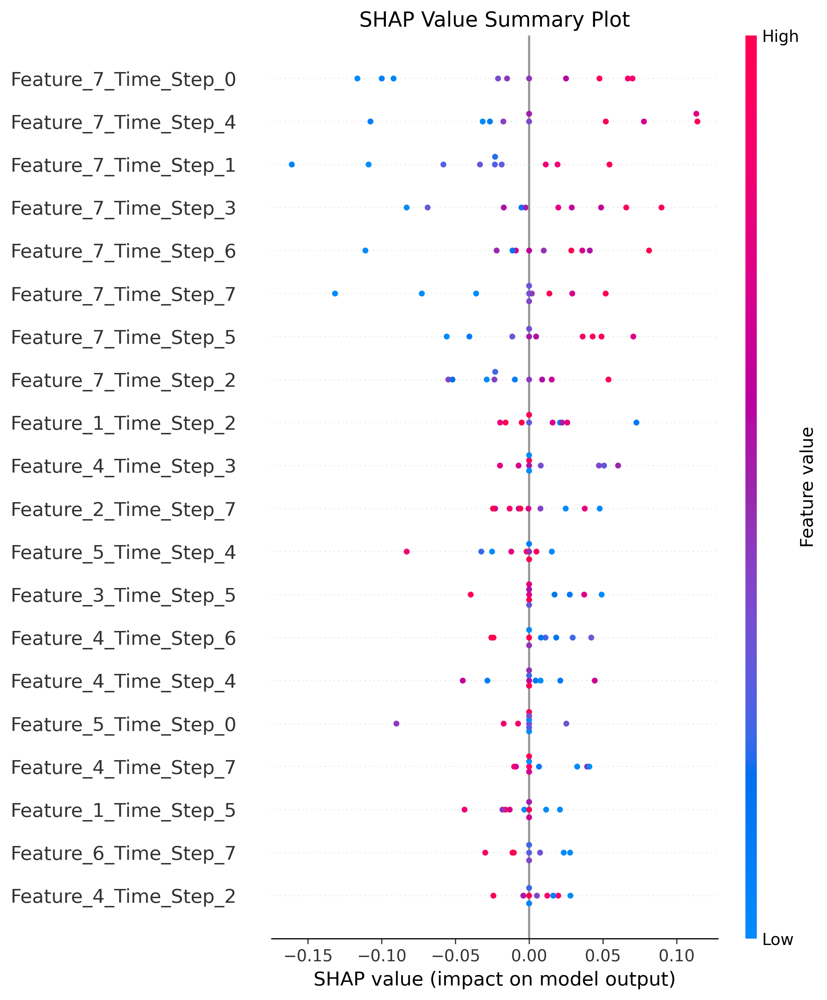
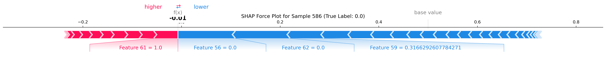

# 模型评估报告

## 基本信息
- 评估时间: 2025-11-20 22:41:55
- 设备: cuda
- 测试集样本数量: 2000

## 性能指标
- **准确率**: 0.9165
- **精确率**: 0.9228
- **召回率**: 0.9090
- **F1分数**: 0.9159
- **AUC**: 0.0000

## 混淆矩阵
- 真阳性 (TP): 909
- 假阳性 (FP): 76
- 假阴性 (FN): 91
- 真阴性 (TN): 924

## 结果可视化
- 混淆矩阵: 
- ROC曲线: 
- 预测概率分布: 

## SHAP分析
- SHAP摘要图: 
- 特征重要性: 
- SHAP力图示例: 
- SHAP值数据: `result/shap/`
- 特征重要性数据: `result/feature_importance.csv`
- 原始数据: `result/raw_data/`

## 结论
模型在学业风险预测任务上表现良好。重点关注以下方面：
1. 模型能够有效识别有学业风险的学生
2. 主要影响因素包括：Phone Usage, Quiz Performance, Participation
3. 建议对高风险学生进行早期干预
